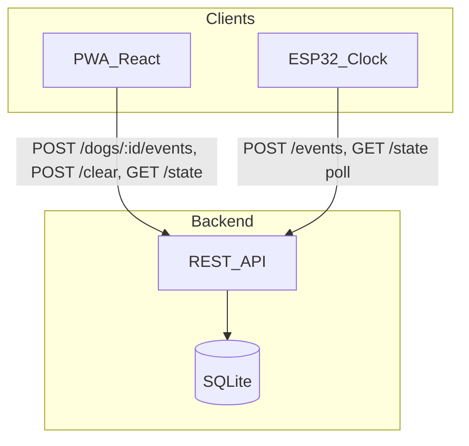
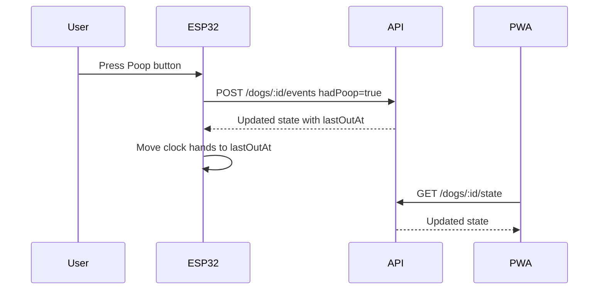

# Potty Tracker — Development Plan

## Product summary

Three primary actions:

- **Out** — dog was taken out (no poop), logged at the current time
- **Poop** — dog was taken out **and** pooped, logged at the current time
- **Clear** — resets the displayed "last potty" time to empty (for when the stored time is known to be wrong)

Additionally, users can **log a past event** by specifying when the outing happened instead of using the current time.

Each potty press creates an event: `{ type: 'potty', timestamp, hadPoop }`. Clear creates `{ type: 'clear', timestamp }`. The UI shows the last valid potty time (or empty after a clear). A backend keeps phone and ESP32 in sync.

**Confirmed decisions:**

- Poop implies taken out (not independent events)
- ESP32 clock sync is a near-term priority — backend/API in Phase 1
- **Self-hosted** deployment (no managed cloud required)
- **Multi-dog data model from day one**; UI starts with one default dog
- **Temporal API** for all date/time logic (with polyfill for Safari/iOS PWA)
- ESP32 display is a **motor-controlled physical clock** (hardware details deferred)
- **Notifications deferred** until after the physical clock is built and working
- **TDD required** — tests written before implementation for every feature; coverage enforced project-wide
- **Agent control files** in `.cursor/rules/` + `AGENTS.md` for project-level AI guidance
- **Knowledge base** in `docs/knowledge/` for durable project reference material
- **GitHub** for remote hosting + CI; agents **must ask before every commit and every push** — never push without explicit approval

---

## Architecture



**Why backend in Phase 1:** ESP32 sync requires shared state. Local-only storage would force a painful migration later.

**Sync model:** REST + polling (ESP32-friendly). PWA uses the same endpoints; optional SSE/WebSocket later for instant phone updates.

---

## Data model

```typescript
interface Dog {
  id: string;
  name: string;
  createdAt: string;    // ISO 8601 UTC Instant
}

interface PottyEvent {
  id: string;
  dogId: string;
  type: 'potty';
  timestamp: string;    // ISO 8601 UTC Instant — when the outing happened
  hadPoop: boolean;
}

interface ClearEvent {
  id: string;
  dogId: string;
  type: 'clear';
  timestamp: string;    // ISO 8601 UTC Instant — when clear was pressed
}

type TrackerEvent = PottyEvent | ClearEvent;

interface PottyState {
  dogId: string;
  lastEvent: PottyEvent | null;
  lastOutAt: string | null;   // ISO Instant — most recent potty event (any)
  lastPoopAt: string | null;  // ISO Instant — most recent potty event with hadPoop=true
  isCleared: boolean;         // true when most recent event is a clear
}
```

**Multi-dog:** Every event and state query is scoped by `dogId`. Seed a default dog (e.g. `"Default"`) on first API startup. PWA includes a dog selector; with one dog it can be hidden or shown as a simple label. Adding dogs later requires no schema migration.

**Storage:** All timestamps persisted as **UTC ISO 8601 strings** (`2026-08-12T17:30:00Z`). This keeps the DB simple and ESP32-friendly. Temporal handles parsing, validation, and display conversion in TypeScript.

**State computation:**

1. Find the most recent `clear` event by insertion time. If none, consider all potty events.
2. If the most recent event overall (by insertion time) is `clear`, return null state (`isCleared: true`).
3. Otherwise, among potty events after the latest clear, pick `lastOutAt` / `lastPoopAt` by **event timestamp** (not insertion order), so a backdated entry correctly updates display only if its timestamp is the newest outing.

Derived UI (computed client-side):

- "Last out: 2:34 PM" (from `lastOutAt`, or "—" when cleared/empty)
- "Last poop: 11:00 AM" (from `lastPoopAt`, optional in MVP)
- "2h 15m ago" (elapsed since `lastOutAt`; hidden when cleared/empty)

---

## API contract

All routes are scoped by dog. Use path prefix `/api/dogs/:dogId/...`.

| Method | Path | Purpose |
|--------|------|---------|
| `GET` | `/api/dogs` | List dogs |
| `POST` | `/api/dogs` | Create dog `{ name: string }` |
| `GET` | `/api/dogs/:dogId/state` | Current `PottyState` for display |
| `POST` | `/api/dogs/:dogId/events` | Body: `{ hadPoop: boolean, timestamp?: string }` — creates potty event, returns updated state |
| `POST` | `/api/dogs/:dogId/clear` | Resets displayed state to empty; inserts clear event |
| `GET` | `/api/dogs/:dogId/events?limit=N` | Recent history (Phase 2+) |
| `GET` | `/api/health` | Health check (Phase 2) |

**Validation rules for `POST .../events`:**

- `timestamp` must be valid ISO 8601 Instant if provided; parsed via `Temporal.Instant.from()`
- Reject timestamps in the future (allow ~1 min clock skew via `Temporal.Instant.compare()`)
- ESP32 always omits `timestamp` (server assigns `Temporal.Now.instant()`)

Auth: shared **API key** in header (`X-API-Key`) — no user accounts for MVP.

---

## Time handling (Temporal API)

**Yes — use Temporal.** It is the right tool for this project and works in TypeScript today.

| Environment | Support |
|-------------|---------|
| Chrome 144+, Firefox 139+ | Native `Temporal` |
| Node.js 26+ | Native `Temporal` |
| Safari / iOS PWA | Not yet native — use polyfill |
| TypeScript | Supported via `esnext.temporal` lib (TS 6+) or `temporal-polyfill` type imports |

**Strategy:**

1. Add `temporal-polyfill` to `packages/shared` — single source of date/time utilities
2. **Never use `Date` for business logic** — only Temporal types at boundaries
3. **DB/API wire format:** UTC ISO strings (`Temporal.Instant.toString()`)
4. **Display:** convert to user's local timezone with `Temporal.Instant.toZonedDateTimeISO(Temporal.Now.timeZoneId())`
5. **Backdate picker:** build from `Temporal.PlainDateTime`, convert to Instant before POST
6. **Relative time ("3h ago"):** `Temporal.Now.instant().since(lastOutInstant)` → format duration
7. **Polyfill:** import `temporal-polyfill/global` in web entry + API entry so Safari/iOS PWA works

```typescript
// packages/shared/src/time.ts (example)
import 'temporal-polyfill/global';

export function parseInstant(iso: string): Temporal.Instant {
  return Temporal.Instant.from(iso);
}

export function formatLocalTime(iso: string, timeZone = Temporal.Now.timeZoneId()): string {
  return parseInstant(iso)
    .toZonedDateTimeISO(timeZone)
    .toLocaleString('en-US', { hour: 'numeric', minute: '2-digit' });
}

export function formatRelative(iso: string): string {
  const duration = parseInstant(iso).until(Temporal.Now.instant(), { largestUnit: 'hour' });
  // format as "1h 23m ago"
}
```

ESP32 firmware does **not** use Temporal — it receives/sends ISO strings and lets the server validate.

## Tech stack

| Layer | Choice | Rationale |
|-------|--------|-----------|
| Frontend | Vite + React + TypeScript | Fast scaffold, great PWA support |
| PWA | vite-plugin-pwa | Service worker, installable, offline shell |
| Styling | CSS modules or Tailwind | Simple UI, large tap targets |
| Backend | Hono on Node | Lightweight, TypeScript-native |
| Database | SQLite (better-sqlite3) | Zero-config, ideal for self-hosted |
| Date/time | Temporal API + `temporal-polyfill` | Correct timezone/duration handling; polyfill for Safari PWA |
| Hosting | **Self-hosted** (Docker Compose) | API serves REST + static PWA; reverse proxy optional (Caddy/nginx) |
| ESP32 | Arduino/PlatformIO, WiFi, HTTPClient, stepper/servo motor | Poll every 30–60s; motor positions clock hands |
| Testing | **Vitest** + Testing Library + coverage (v8) | Fast, Vite-native; works across monorepo packages |
| CI | GitHub Actions (or local pre-commit) | `test`, `test:coverage`, lint on every change |

**Repository layout (two codebases, one git repo):**

```
PottyTracker/
├── .cursor/rules/          # Agent control files
├── docs/knowledge/         # Knowledge base (both codebases)
├── software/               # TypeScript monorepo (pnpm) — PWA + API
│   ├── apps/web/
│   ├── apps/api/
│   └── packages/shared/
├── firmware/               # Embedded codebases (NOT in pnpm)
│   └── esp32-clock/        # PlatformIO — motor clock + buttons
├── AGENTS.md
├── docker-compose.yml      # Phase 1
├── vitest.workspace.ts     # Software tests only
├── pnpm-workspace.yaml
└── package.json            # pnpm root (software packages)
```

**Self-hosted deployment:**

- Docker Compose runs API container; SQLite volume mounted for persistence
- API serves built PWA from `software/apps/web/dist` (single origin, no CORS hassle)
- Accessible on home network (e.g. `http://potty.local` via mDNS or static IP)
- ESP32 points at same host URL + API key

---

## Testing & TDD

**Policy:** Every feature follows Test-Driven Development. No production code for a feature without failing tests written first.

### Workflow (Red → Green → Refactor)

1. **Plan** the feature (update `PLAN.md` or a knowledge doc if needed)
2. **Red** — write failing unit/integration tests that describe expected behavior
3. **Green** — implement the minimum code to pass
4. **Refactor** — clean up while keeping tests green
5. **Coverage** — confirm thresholds met before marking feature done

This applies to `software/packages/shared`, `software/apps/api`, and `software/apps/web`. Firmware uses PlatformIO/native tests where applicable.

### Test stack

| Package | Tooling |
|---------|---------|
| All TS packages | **Vitest** (workspace via `vitest.workspace.ts`) |
| `software/packages/shared` | Vitest unit tests for state logic, Temporal utils, API client |
| `software/apps/api` | Vitest + in-memory/fixed SQLite for route + DB tests |
| `software/apps/web` | Vitest + **@testing-library/react** + **user-event** for components/hooks |

### Coverage requirements

Enforced in root Vitest config via `@vitest/coverage-v8`:

| Scope | Minimum line coverage |
|-------|----------------------|
| `software/packages/shared` | **90%** (pure logic — highest bar) |
| `software/apps/api` | **85%** |
| `software/apps/web` | **80%** (UI — exclude PWA boilerplate/service worker from thresholds) |
| **Project overall** | **85%** |

Commands (root):

- `pnpm test` — run all tests (watch mode in dev)
- `pnpm test:coverage` — run with coverage report; **fails CI if below threshold**
- `pnpm test --filter @potty/shared` — run single package

### What to test (by layer)

- **shared:** `computePottyState()`, Temporal format/parse/validate, API client request shaping
- **api:** route handlers, auth middleware, timestamp validation, dog scoping, clear semantics, backdating edge cases
- **web:** button handlers, clear confirm flow, backdate picker → API payload, empty/cleared display states, dog selector

### CI integration

GitHub Actions workflow (`.github/workflows/test.yml`):

1. `pnpm install`
2. `pnpm test:coverage`
3. Optional: lint + typecheck

Tests run on every push/PR. Coverage report uploaded as artifact (optional Codecov later).

---

## Agent control files & knowledge base

Persistent project context for AI agents and future sessions.

### Agent control files (`.cursor/rules/`)

Cursor rules (`.mdc` files) enforce how agents work in this repo. Created during Phase 0 scaffold:

| File | Scope | Purpose |
|------|-------|---------|
| `tdd-workflow.mdc` | `alwaysApply: true` | Red-green-refactor; tests before implementation; coverage gates |
| `project-conventions.mdc` | `alwaysApply: true` | Monorepo layout, Temporal-only dates, multi-dog scoping, no `Date` |
| `api-conventions.mdc` | `software/apps/api/**` | Hono patterns, dog-scoped routes, ISO timestamp wire format |
| `react-patterns.mdc` | `software/apps/web/**` | Component structure, Testing Library usage, PWA constraints |
| `firmware-conventions.mdc` | `firmware/**` | PlatformIO, HTTP API contract, no shared TS |
| `git-policy.mdc` | `alwaysApply: true` | Ask before every commit and push; never push without explicit user approval |

**[`AGENTS.md`](AGENTS.md)** (repo root) — single entry point linking rules, knowledge base, TDD workflow, and key commands (`pnpm dev`, `pnpm test`, etc.). Update when conventions change.

### Knowledge base (`docs/knowledge/`)

Durable reference docs agents (and humans) read before tackling a domain. Indexed in `docs/knowledge/README.md`:

```
docs/knowledge/
├── README.md           # Index with short descriptions + last-updated dates
├── architecture.md     # System overview, data flow (synced from PLAN.md highlights)
├── decisions.md        # ADR-style log of design decisions
├── temporal.md         # Temporal usage patterns specific to this project
├── deployment.md       # Self-hosted Docker, env vars, network setup
└── esp32-clock.md      # Hardware notes (populated in Phase 3)
```

**When to write to the knowledge base:**

- Non-obvious design decisions (add to `decisions.md`)
- Deployment/hosting quirks discovered during setup
- ESP32 motor/clock mechanics once hardware work starts
- Anything you'd want an agent to "remember" next session without re-explaining

Agents should **read relevant knowledge docs** before implementing features in that area, and **update docs** when behavior or setup changes.

---

## GitHub & Git policy

The repo is set up to work with **GitHub** (remote origin, Actions CI, standard `.gitignore`). Self-hosted deployment is separate — GitHub is for source control and CI only.

### Agent rules (non-negotiable)

| Action | Policy |
|--------|--------|
| **`git commit`** | **Ask the user every time** before committing. Never commit unprompted, even after completing work. |
| **`git push`** | **Ask the user every time** before pushing. **NEVER push without explicit approval.** No exceptions. |
| **Force push** | Never, unless the user explicitly requests it |
| **Remote setup** | OK to configure `origin` and prepare the repo for GitHub during Phase 0 |
| **GitHub Actions** | OK to add workflow files locally; pushing them requires the push approval above |

These rules are enforced in **`.cursor/rules/git-policy.mdc`** (`alwaysApply: true`) and summarized in **`AGENTS.md`**.

**Typical flow after completing work:**

1. Agent summarizes changes
2. Agent asks: *"Would you like me to commit these changes? If so, what message?"*
3. Only commits if user says yes
4. Agent asks separately: *"Would you like me to push to GitHub?"*
5. Only pushes if user explicitly says yes

---

## Development phases

### Phase 0 — Project foundation (before features)

**Goal:** Repo scaffold, testing infrastructure, agent files, and knowledge base — so Phase 1 starts with TDD from the first line of feature code.

1. Initialize pnpm monorepo + TypeScript project references
2. Configure **Vitest workspace** + coverage thresholds (`vitest.workspace.ts`, per-package configs)
3. Create **`.cursor/rules/`** (TDD, conventions, api, react, **git-policy**) + **`AGENTS.md`**
4. Create **`docs/knowledge/`** skeleton (`README.md`, `architecture.md`, `decisions.md`, `temporal.md`)
5. **GitHub setup:** `.gitignore`, `.github/workflows/test.yml`, document remote setup in README — **do not commit or push without asking user first**
6. Seed `packages/shared` with first TDD cycle: `computePottyState()` tests → then implementation

**Success criteria:** `pnpm test:coverage` passes with threshold config in place (even if coverage is low initially from scaffold-only code).

---

### Phase 1 — Core loop

**Goal:** Press button on phone → event stored → last time displayed. Installable PWA. **All features built via TDD.**

1. **shared (TDD):** Temporal time utils — tests first, then `time.ts`
2. **api (TDD):** SQLite schema (`dogs`, `events`), dog-scoped routes — route tests before handlers
3. **web (TDD):** UI components — test button flows, display states, then implement
4. Build PWA UI:
   - Dog selector (hidden/minimal when only one dog)
   - Two large buttons: **Out** / **Poop** (log at current time)
   - **Clear** button (secondary style) with confirm dialog before sending
   - Display last outing time + relative time ("3h ago"), or empty state after clear
   - Visual indicator if last event included poop
   - **Log past event** section: date/time picker (Temporal-backed) + Out/Poop buttons
5. Add PWA manifest + service worker (offline app shell)
6. Add Docker Compose for self-hosted deploy; document in `docs/knowledge/deployment.md`
7. Smoke-test on phone via home network

**Success criteria:** Install PWA, tap Out, see updated timestamp persist after refresh. Clear resets display. Backdated event shows the chosen time. **`pnpm test:coverage` passes all thresholds.**

---

### Phase 2 — History and resilience

Each item: **tests first**, then implementation.

1. `GET /api/dogs/:dogId/events?limit=20` + collapsible history list in PWA
2. Optimistic UI on button press with rollback on API failure
3. Environment-based API URL + API key config
4. `GET /api/health` endpoint

---

### Phase 3 — ESP32 motor clock

**Goal:** Physical clock hands reflect last outing time; buttons mirror app.

1. **Hardware (deferred specifics):** ESP32 + 2 buttons + motor driver + stepper/servo for clock hands. Exact mechanism TBD after software infrastructure is working.
2. **Firmware (software-first scope):**
   - WiFi connect (credentials in config/NVS)
   - Poll `GET /api/dogs/:dogId/state` every 30s
   - Button debounce → `POST /api/dogs/:dogId/events` (no custom timestamp)
   - Map `lastOutAt` ISO string → motor positions for hour/minute hands (or "cleared" position when `isCleared`)
   - Optional: physical Clear button → `POST /api/dogs/:dogId/clear`
3. Server timestamp wins for ESP32 button presses (no backdating from hardware)
4. Test: phone press → clock hands move; clock press → phone updates



---

### Phase 4 — Notifications (deferred)

**Status:** Out of scope until the physical clock is constructed and working. Revisit after Phase 3.

When implemented, likely approach: Web Push + server cron checking `now - lastOutAt > threshold`. No design work needed now.

## UI sketch (Phase 1)

```
┌─────────────────────────────┐
│      Potty Tracker          │
│                             │
│     Last out: 2:34 PM       │
│        (1h 23m ago)         │
│     Last poop: 11:00 AM     │
│                             │
│  ┌──────────┐ ┌──────────┐  │
│  │   OUT    │ │   POOP   │  │
│  └──────────┘ └──────────┘  │
│         [ Clear ]           │
│                             │
│  ── Log past event ──       │
│  [ Aug 12, 10:30 AM    ▼]   │
│  ┌──────────┐ ┌──────────┐  │
│  │ Log Out  │ │ Log Poop │  │
│  └──────────┘ └──────────┘  │
└─────────────────────────────┘
```

Large touch targets (min 48px), high contrast, one-handed use. Clear is visually de-emphasized and requires confirmation. "Log past event" is separated from quick-log buttons to avoid accidental backdating.

---

## Resolved decisions

| # | Question | Decision |
|---|----------|----------|
| 1 | Hosting | **Self-hosted** via Docker Compose on home network |
| 2 | ESP32 display | **Motor-controlled physical clock** — hardware specifics after software is done |
| 3 | Notifications | **Deferred** until after physical clock is built |
| 4 | Multiple dogs | **Multi-dog schema from start**; one default dog in UI initially |
| 5 | Timezones | **Temporal API** + polyfill; store UTC Instants, display in local timezone |
| 6 | Testing | **TDD** with Vitest; 85% overall coverage enforced in CI |
| 7 | Agent docs | **`.cursor/rules/`** + **`AGENTS.md`** + **`docs/knowledge/`** |
| 8 | Git / GitHub | **GitHub remote + CI**; agents ask before **every commit and every push** |

---

## Implementation todos

**Phase 0 — Foundation**
- [ ] Scaffold pnpm monorepo + Vitest workspace + coverage thresholds
- [ ] Create `.cursor/rules/` (TDD, conventions, api, react, **git-policy**) + `AGENTS.md`
- [ ] Create `docs/knowledge/` skeleton (README, architecture, decisions, temporal)
- [ ] GitHub setup: `.gitignore`, `.github/workflows/test.yml`, README remote instructions (no commit/push without asking)
- [ ] TDD seed: `computePottyState()` tests → implementation in `packages/shared`

**Phase 1 — Core loop (TDD throughout)**
- [ ] Temporal time utils — tests first, then `packages/shared/time.ts`
- [ ] SQLite `dogs` + `events` tables; dog-scoped API routes — route tests first
- [ ] PWA UI: dog selector, Out/Poop/Clear, backdate picker — component tests first
- [ ] vite-plugin-pwa manifest, service worker, installable app shell
- [ ] Docker Compose + `docs/knowledge/deployment.md`
- [ ] Coverage thresholds met for shared (90%), api (85%), web (80%)

**Phase 2+**
- [ ] Event history endpoint + optimistic UI (TDD)
- [ ] ESP32 firmware: WiFi, poll state, buttons POST events, motor clock hand positioning
- [ ] ~~Notifications~~ — deferred (Phase 4, post-clock)

---

## First implementation session

After plan approval, **Phase 0 first**:

1. Initialize pnpm monorepo + Vitest workspace + coverage config
2. Create `.cursor/rules/`, `AGENTS.md`, `docs/knowledge/` skeleton
3. GitHub Actions test workflow
4. TDD: write `computePottyState()` tests → implement in `packages/shared`
5. TDD: Temporal time utility tests → implement
6. Then proceed to Phase 1 API and web (tests before each feature)

Estimated scope: ~30–35 files (including test files, rules, and knowledge docs).
