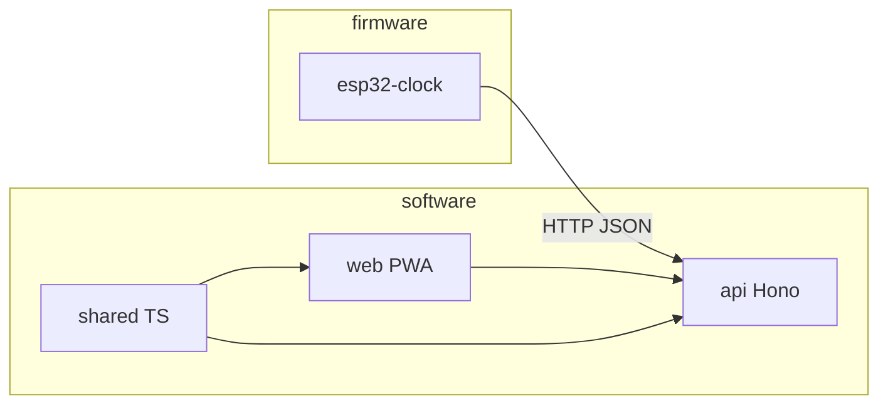

# Architecture

## Overview

Potty Tracker is **one git repository, two codebases**:

| Codebase | Path | Role |
|----------|------|------|
| Software | `software/` | React PWA, Hono API, shared TypeScript (pnpm) |
| Firmware | `firmware/esp32-clock/` | ESP32 motor clock (PlatformIO / C++) |

There is **no shared source code** between them. Integration is via the REST API and ISO 8601 timestamp strings.

## Data flow

1. User taps Out/Poop/Clear in PWA (or on ESP32 buttons)
2. Client POSTs to `/api/dogs/:dogId/events` or `/clear`
3. API persists event to SQLite, computes `PottyState`
4. Clients poll or fetch state to update display / clock hands

## Software packages

- `@potty/shared` — types, `computePottyState()`, Temporal utilities
- `@potty/api` — Hono server, SQLite persistence
- `@potty/web` — React PWA

## Firmware

- `firmware/esp32-clock/` — WiFi, HTTP client, buttons, motor driver (Phase 3)

See [PLAN.md](../../PLAN.md) and [firmware/esp32-clock/README.md](../../firmware/esp32-clock/README.md).
